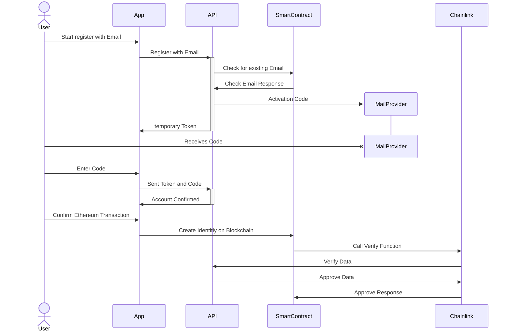
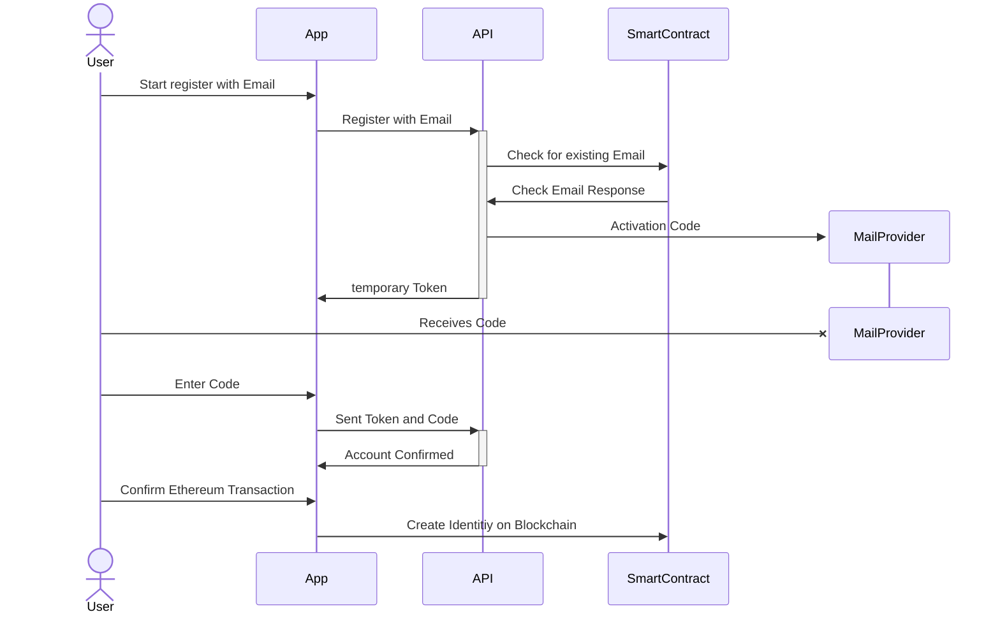
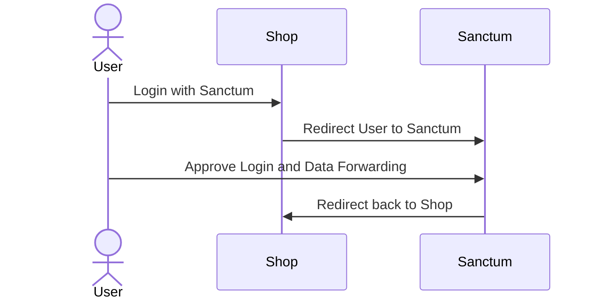

# User Flows

## User Registration

Identity creation using a Chainlink Function.

Identity creation using message verification

## External Authentication

The user is on a e-commerce website and wants to login with the Sanctum Link protocol.

